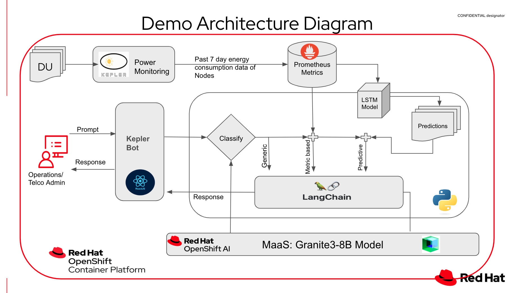

# AI Odyssey 2025 demo-project - AI Energy Savings for RAN DUs
<div align="center">

</div>
<br/>

## Description
AI Energy Savings for RAN / Kepler Bot -> Helps Telco Admins to analyze Energy consumption patterns in their RAN Distributed Units (DU) in order to determine cost saving measures like shutting down specific nodes based on low traffic pattern predictions.

Model Used is : Granite 3 8B model through MaaS hosted on Red Hat Openshift AI

## Project Structure
This is a monorepo containing both frontend and backend components:
```
ai-energy-savings/
├── frontend/           # React frontend application
├── backend/           # Python FastApi application
├── nginx-reverseproxy/  #Reverseproxy NGINX server
```

## Demo Deployment Instructions

***Producing Kepler Data in Openshift***-
***Automated Way***<br/>
oc apply -f kepler.yaml <br/>
oc apply -f kepler_instance.yaml
<br/>

***Manual way*** (only if the automated way fails) <br/>
Kepler is a metrics exporter that uses eBPF to collect energy related system stats and export them. Learn more about kepler [here](https://www.redhat.com/en/blog/introducing-developer-preview-of-kepler-power-monitoring-for-red-hat-openshift).<br/>

***Install Operator***
- Navigate to OperatorHub
- Install Power Monitoring Operator
- Enable User Defined projects to be monitored by creating a configmap in openshift-power-monitoring project
```
apiVersion: v1
kind: ConfigMap
metadata:
  name: cluster-monitoring-config
  namespace: openshift-monitoring
data:
  config.yaml: |
    enableUserWorkload: true
```
- Grab Thanos querier to query our Node power consumption during the build process - This is our PROM_URL excluding trailing /api <br/>

**LLM**<br/>
We provide two options for leveraging an LLM. Option 1 is to use a managed service similar to https://maas.apps.prod.rhoai.rh-aiservices-bu.com/ <br/>
Option 2 is to deploy an LLM directly on OpenShift by creating a build in OpenShift using the Containerfile in the llm directory provided as part of this project.<br/>

***Application Local Install***
```
git clone _
```

***Frontend***

```
cd frontend
npm install
npm run dev

```


***Backend***

```
cd backend
pip install -r requirements.txt
uvicorn app:app --reload
```
If you run into issues with dependencies, please create a virtual env and install requirements.txt. Python 3.8.2 worked fine as torch is used in this.

**Deployment on Openshift**
1.
From Developer Catalog, Deploy backend as from /backend folder using git Dockerfile in the folder
Add env variables :
```
MODEL_URL = <model_url endpoint>
MODEL_ACCESS_KEY = <authentication bearer for model url api>
MODEL_NAME = <granite-3-8b-instruct>
PROM_URL = <url for the prometheus thanos querier for Kepler data - without /api at the end>
PROM_ACCESS_TOKEN = <authentication bearer for Kepler query>

```

2. 
From Developer Catalog, Deploy nginx reverseproxy from /nginx-reverseproxy as NGINX server -regular deployment
Enable Route --> this will be out endpoint for the whole app.

3.
From Developer Catalog, Deploy /frontend from Dockerfile - regular deployment

Once all 3 deployments are up, #2 route is the app endpoint.
Click on Refresh Kepler Data to view Kepler data.
>>check with Hello to see its working
>>Sample prompts:
1. Can you predict next 2 hour node energy consumption?

2. What are the least energy consumed times past 2 days

3. Can you suggest a node shut down schedule based on previous 2 days energy consumption?


Please reach out if you have feedback/questions! Happy to help. 
Contacts of Authors:
Hanvitha Gavini - https://www.linkedin.com/in/hanvitha/
Rony Haddad - https://www.linkedin.com/in/rony-haddad-192b699

